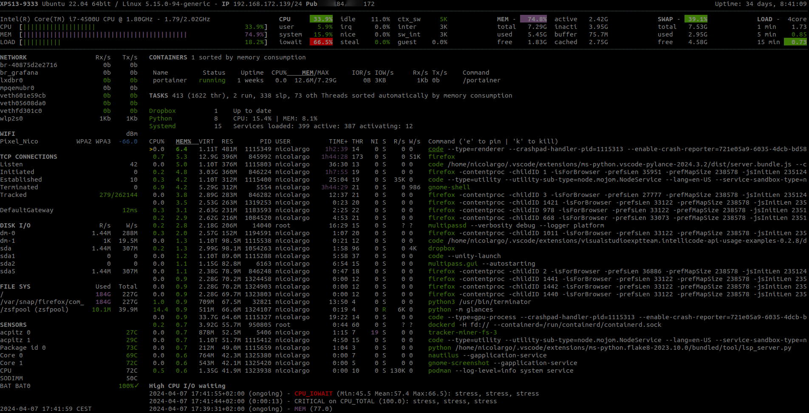

<!--
N.B.: This README was automatically generated by <https://github.com/YunoHost/apps/tree/master/tools/readme_generator>
It shall NOT be edited by hand.
-->

# Glances for YunoHost

[](https://ci-apps.yunohost.org/ci/apps/glances/)


[](https://install-app.yunohost.org/?app=glances)

*[Read this README in other languages.](./ALL_README.md)*

> *This package allows you to install Glances quickly and simply on a YunoHost server.*  
> *If you don't have YunoHost, please consult [the guide](https://yunohost.org/install) to learn how to install it.*

## Overview

Glances is a cross-platform monitoring tool that aims to present maximum information in minimal space through either a curses-based or Web-based interface. It can dynamically adapt the displayed information depending on the terminal size.


**Shipped version:** 4.3.0.8~ynh1

## Screenshots



## Documentation and resources

- Official app website: <https://nicolargo.github.io/glances/?ref=selfh.st>
- Official admin documentation: <https://glances.readthedocs.io/en/latest/index.html>
- Upstream app code repository: <https://github.com/nicolargo/glances>
- YunoHost Store: <https://apps.yunohost.org/app/glances>
- Report a bug: <https://github.com/YunoHost-Apps/glances_ynh/issues>

## Developer info

Please send your pull request to the [`testing` branch](https://github.com/YunoHost-Apps/glances_ynh/tree/testing).

To try the `testing` branch, please proceed like that:

```bash
sudo yunohost app install https://github.com/YunoHost-Apps/glances_ynh/tree/testing --debug
or
sudo yunohost app upgrade glances -u https://github.com/YunoHost-Apps/glances_ynh/tree/testing --debug
```

**More info regarding app packaging:** <https://yunohost.org/packaging_apps>
