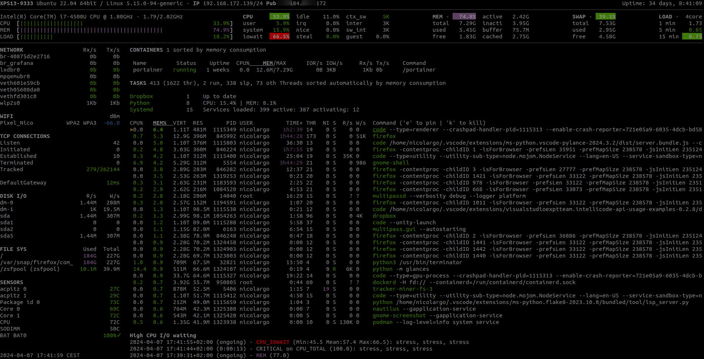

<!--
Este archivo README esta generado automaticamente<https://github.com/YunoHost/apps/tree/master/tools/readme_generator>
No se debe editar a mano.
-->

# Glances para Yunohost

[](https://ci-apps.yunohost.org/ci/apps/glances/)


[](https://install-app.yunohost.org/?app=glances)

*[Leer este README en otros idiomas.](./ALL_README.md)*

> *Este paquete le permite instalarGlances rapidamente y simplement en un servidor YunoHost.*  
> *Si no tiene YunoHost, visita [the guide](https://yunohost.org/install) para aprender como instalarla.*

## Descripción general

Glances is a cross-platform monitoring tool that aims to present maximum information in minimal space through either a curses-based or Web-based interface. It can dynamically adapt the displayed information depending on the terminal size.


**Versión actual:** 4.3.0.8~ynh1

## Capturas



## Documentaciones y recursos

- Sitio web oficial: <https://nicolargo.github.io/glances/?ref=selfh.st>
- Documentación administrador oficial: <https://glances.readthedocs.io/en/latest/index.html>
- Repositorio del código fuente oficial de la aplicación : <https://github.com/nicolargo/glances>
- Catálogo YunoHost: <https://apps.yunohost.org/app/glances>
- Reportar un error: <https://github.com/YunoHost-Apps/glances_ynh/issues>

## Información para desarrolladores

Por favor enviar sus correcciones a la [rama `testing`](https://github.com/YunoHost-Apps/glances_ynh/tree/testing).

Para probar la rama `testing`, sigue asÍ:

```bash
sudo yunohost app install https://github.com/YunoHost-Apps/glances_ynh/tree/testing --debug
o
sudo yunohost app upgrade glances -u https://github.com/YunoHost-Apps/glances_ynh/tree/testing --debug
```

**Mas informaciones sobre el empaquetado de aplicaciones:** <https://yunohost.org/packaging_apps>
